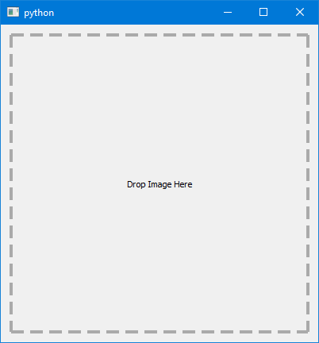

# hark_images
Listen to words in an image (detected text --> speech)

This is a program which recognizes words in an image and converts the text to speech.

### Python3 Libraries used:
**Tesseract-OCR (pytesseract):** recognizes characters in image (please install Tesseract-OCR on your machine to run the program)

**pyttsx3:** text to speech

**OpenCV2 (cv2)**

**PyQt5:** make the GUI application

**numpy**

## How to Use:

1. Run app.py
```
python app.py
```



2. Drag and Drop the image you want to listen to.
